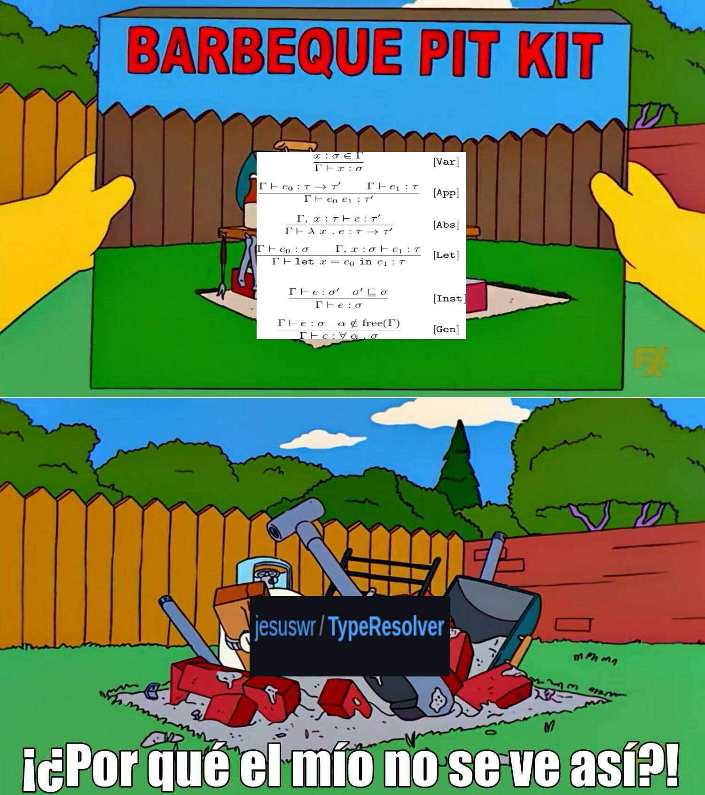

# TypeResolver


Simple type resolver in haskell

Doesnt work perfectly but it was interesting

Also it doesnt manage well some errors xD

```
BIENVENIDO

QUE DESEA HACER?
DEF 0 Int
SE DEFINIO '0' CON TIPO: Int

QUE DESEA HACER?
DEF 1 Int
SE DEFINIO '1' CON TIPO: Int

QUE DESEA HACER?
DEF n Int
SE DEFINIO 'n' CON TIPO: Int

QUE DESEA HACER?
DEF eq a -> a -> Bool
SE DEFINIO 'eq' CON TIPO: a -> a -> Bool

QUE DESEA HACER?
TIPO eq 0
Int -> Bool

QUE DESEA HACER?
TIPO eq 2
ERROR, UN NOMBRE DADO NO HA SIDO DEFINIDO

QUE DESEA HACER?
DEF prod Int -> Int -> Int
SE DEFINIO 'prod' CON TIPO: Int -> Int -> Int

QUE DESEA HACER?
DEF prod Int -> Int -> Int
SE DEFINIO 'prod' CON TIPO: Int -> Int -> Int

QUE DESEA HACER?
DEF dif Int -> Int -> Int
SE DEFINIO 'dif' CON TIPO: Int -> Int -> Int

QUE DESEA HACER?
DEF if Bool -> a -> a -> a
SE DEFINIO 'if' CON TIPO: Bool -> a -> a -> a

QUE DESEA HACER?
TIPO if (eq 0 n) 1 n
Int

QUE DESEA HACER?
DEF fact t->t
SE DEFINIO 'fact' CON TIPO: t -> t

QUE DESEA HACER?
TIPO eq (fact n) (if (eq n 0) 1 (prod n (fact (dif n 1))))
Bool
```
